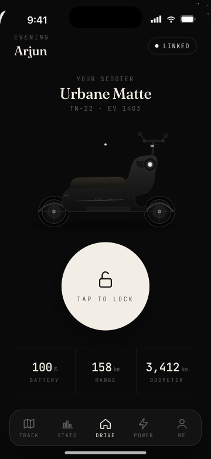
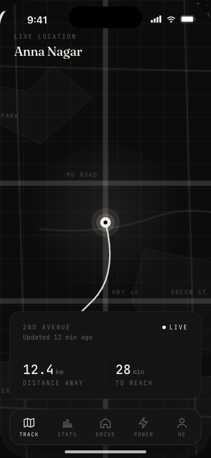
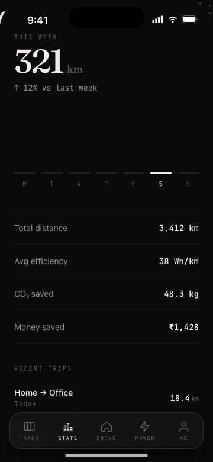
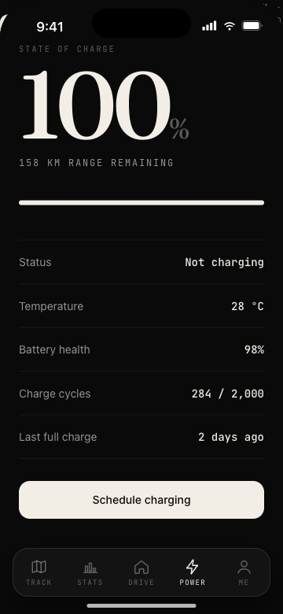
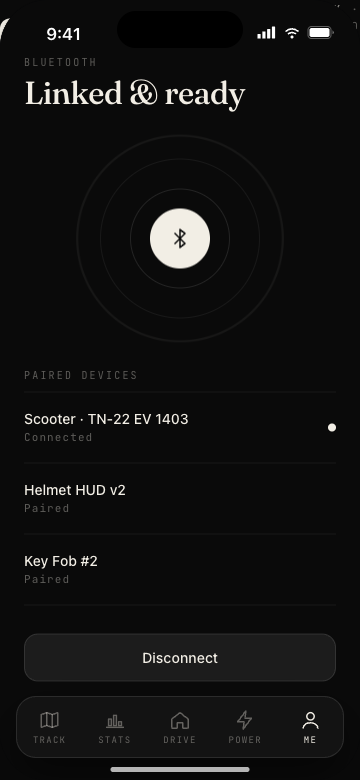
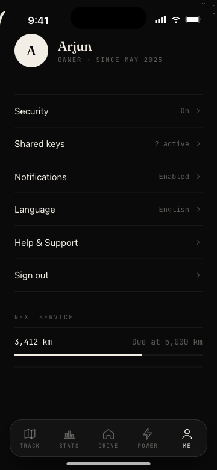

# ESP32-EV — Electric Scooter Companion

A dark, minimal, CRED-style iOS companion app for a connected electric scooter. Bluetooth telemetry, live GPS, ride analytics, battery health, and a reliable remote lock — wrapped in a quiet typographic dark UI.

**🔗 Live web app → https://aakashnarukula-dev.github.io/esp32-ev/**

> The live app is the Expo / React Native web build of the real source, running a dummy vehicle simulation entirely in the browser — synthetic GPS drift, battery drain, lock/unlock responses. No ESP32 required. Unlock from the **Drive** tab and watch the **Maps** tab come alive.

---

## Screens

<p align="center">
  
  
  
</p>
<p align="center">
  
  
  
</p>

| Screen | Purpose |
|---|---|
| **Drive** — home | Battery ring, range, unlock gesture |
| **Track** — map | Live position, route line, ETA |
| **Stats** — analytics | Weekly distance, efficiency, trips |
| **Power** — battery | State of charge, health, schedule |
| **Devices** — bluetooth | Paired devices, active link pulse |
| **Me** — profile | Rider, security, next service |

---

## Design System

| | |
|---|---|
| Background | `#0A0A0A` near-black |
| Text / accent | `#F2EEE5` warm ivory |
| Warn · Danger · Success | `#D6B17A` · `#D97B7B` · `#9FBF9F` |
| Display serif | Fraunces (variable) |
| UI sans | Inter |
| Numerics / labels | JetBrains Mono |
| Device | iPhone 360 × 780 |

Full tokens & motion: [`docs/design.md`](docs/design.md). Per-screen walkthrough: [`docs/screens.md`](docs/screens.md).

---

## Repo layout

```
.
├── README.md
├── App.tsx                ← Expo entry
├── app.json               ← Expo config (baseUrl /esp32-ev)
├── package.json
├── src/
│   ├── screens/           ← Drive, Maps, Charge, Me and child screens
│   ├── components/        ← ScooterHero, TabBar, DeviceFrame, …
│   ├── lib/               ← geocode, routing, geo, chargers, esp32
│   ├── store/             ← Redux (voltSlice, uiSlice)
│   ├── navigation/
│   └── theme/
├── mock/                  ← in-browser vehicle simulation
├── firmware/              ← ESP32 reference sketch
├── _expo/ · assets/ · index.html · metadata.json   ← prebuilt web build (GitHub Pages)
├── images/screens/        ← rendered phone mockups
└── docs/
    ├── design.md
    └── screens.md
```

---

## About

Design by [Aakash Narukula](https://github.com/aakashnarukula-dev).
